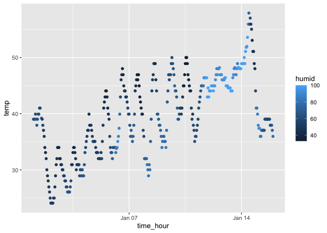

p8105_hw1_xw2962
================
Xiaoyu Wu
2023-09-14

## Problem 1

#### Load the moderndive library

``` r
library(tidyverse)
```

    ## ── Attaching core tidyverse packages ──────────────────────── tidyverse 2.0.0 ──
    ## ✔ dplyr     1.1.3     ✔ readr     2.1.4
    ## ✔ forcats   1.0.0     ✔ stringr   1.5.0
    ## ✔ ggplot2   3.4.3     ✔ tibble    3.2.1
    ## ✔ lubridate 1.9.2     ✔ tidyr     1.3.0
    ## ✔ purrr     1.0.2     
    ## ── Conflicts ────────────────────────────────────────── tidyverse_conflicts() ──
    ## ✖ dplyr::filter() masks stats::filter()
    ## ✖ dplyr::lag()    masks stats::lag()
    ## ℹ Use the conflicted package (<http://conflicted.r-lib.org/>) to force all conflicts to become errors

``` r
library(moderndive)
```

#### Load the early_january_weather dataset

``` r
data("early_january_weather")
```

#### Short Description of the Dataset

This dataset has 15 variables origin, year, month, day, hour, temp,
dewp, humid, wind_dir, wind_speed, wind_gust, precip, pressure, visib,
time_hour

There are 358 rows. And there are 15 columns

The mean of the temperature is 39.5821229

#### Making a scatterplot and Save the Plot

``` r
time_hour=early_january_weather$time_hour
temp=early_january_weather$temp
ggplot(early_january_weather, aes(x = time_hour, y = temp,color=humid)) + geom_point()
```

<!-- -->

``` r
ggsave("scatter_plot_hw1_q1.pdf",height=4,width=4)
```

#### Describe patterns that are apparent in this plot

The temp increases with the increasing time_hour. The temp reaches
maximum value around Jan 14th. And humid increases with increasing temp.

## Problem 2

#### Dataframe Creation and Variable Means

``` r
example_df = tibble(
  norm_samp = rnorm(10),
  vec_logical = norm_samp > 0,
  vec_char = c("It", "is", "so", "nice", "to", "meet", "you", "and", "Sarah", "here"),
  vec_factor = factor(c("serious", "mild", "healthy", "healthy", "mild", "mild", "serious", "mild", "mild", "healthy"))
)
mean(pull(example_df,norm_samp))
```

    ## [1] -0.08198412

``` r
mean(pull(example_df,vec_logical))
```

    ## [1] 0.5

``` r
mean(pull(example_df,vec_char))
```

    ## Warning in mean.default(pull(example_df, vec_char)): argument is not numeric or
    ## logical: returning NA

    ## [1] NA

``` r
mean(pull(example_df,vec_factor))
```

    ## Warning in mean.default(pull(example_df, vec_factor)): argument is not numeric
    ## or logical: returning NA

    ## [1] NA

#### Description for the means

It doesn’t work for creating means for the character vector and the
factor vector. We can successfully create means for random sample
created and the logical vector.

#### Converting Variables

``` r
con_logical=as.numeric(pull(example_df,vec_logical))
con_logical
con_char=as.numeric(pull(example_df,vec_char))
con_char
con_factor=as.numeric(pull(example_df,vec_factor))
con_factor
```

#### Description for converting the variables

When converting logical variables to numeric variables, only 0 and 1
show as the outputs. When converting character variables to numeric
variables, all outputs show NA. When converting factor variables to
numeric variables, the number 1, 2, 3 indicating the three levels of the
factor variables are shown as outputs.

For the logical variables, only two situations can appear. That is,
larger than zero(TRUE) or smaller than zero(FALSE). Thus only 0
representing smaller than zero and 1 representing larger than zero can
appear as outputs when converting to numeric variables. For the
character variables, since all inputs are strings which can not be
converted to numeric variables, all the outputs are shown as NA or none.
For the factor variables, since we create three different factor levels,
we can see 1, 2 and 3 representing each one of the factor levels shown
as the outputs.

This can explain what happened when I tried to take the means. For the
character variables, since they cannot be converted to numeric
variables, we cannot take the means for these character variables. And
for the factor variables, numbers are representing the three different
factor levels without meaningful numeric values when converting to
numeric variables, we also couldn’t take the means for these factor
variables.
